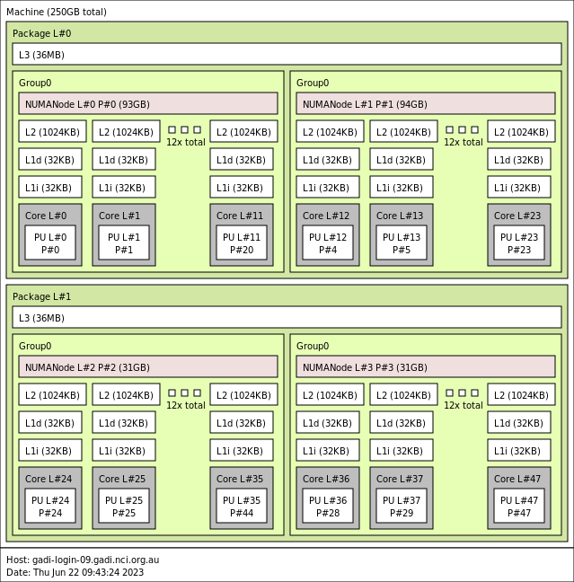
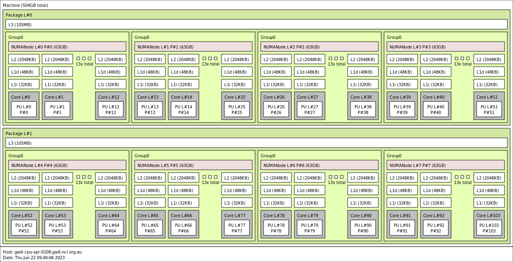

# Hands-On Session #14: NUMA Effects

_Objective: To appreciate the effects of Non Uniform Memory Access (NUMA), that is, the general benefit of ensuring a process and its memory are in the same NUMA domain._

[Instructions for accessing the remote systems](../../systems.md)

* * *

## Set Up

We need a workload with high computational speed and yet significant cache misses to see NUMA effects, so we will use Intel MKL optimized matrix multiply implementation. Set up the required environment by:

```
module load intel-compiler intel-mkl
```

Build the test program by executing the command:

```
make
```

The synopsis of this program is:

`./matmultest [-v <v>] [-p] <N> <K>`

which runs matrix multiply algorithm version _v_ of the form $C = C + AB$, where $A, B, C$ are matrices of sizes $N \times K, K \times N, N \times N$ respectively. The command-line option `-p` can be used to print out the values of the matrices (for debugging).

Do a 64 x 64 matrix multiply via the command:

`./matmultest -v 1 64 64`

This will use a 'vanilla' version of matrix multiply. Locate the code of this version in [`matmult.c`](matmult.c). For compatibility with Fortran numerical libraries, an $M \times N$ matrix $C$ is stored in _column-major-order_, i.e. logical element $C_{ij}$ is stored at the linear address `C + i + M*j`

The macro `V(C, i, j, M)` is used to access logical element $C_{ij}$ from within `matmult.c`.

Try the same command with the MKL multiply (`-v 0` is the default):

`./matmultest -v 0 64 64`

You may find the result surprising. Compare again on much larger sizes, e.g. 1000. What might be the reason for the surprising result?

## numactl

Execute the command:

```
numactl --hardware
```

How many NUMA domains do you see? Assuming 'distance' is proportional to main memory access time, what is the approximate relative penalty of accessing memory in an external domain?

Run the test program five or so times on an 8192 x 8192 result matrix and 'narrow' input matrices (this will heighten NUMA effects):

```
./matmultest 8192 16
```

Repeat this with an enforce favourable and unfavourable process and memory placements:

```
numactl --membind=0 --cpunodebind=0 ./matmultest 8192 16
numactl --membind=2 --cpunodebind=0 ./matmultest 8192 16
```

Now, try placing memory on NUMA domain 1. Are the results as expected? What do you observe?

Try increasing the _K_ parameter from 16 to something larger. How does the difference change, and why?

Try switching from the optimized to the vanilla matrix multiply (`-v 1`). What do you observe now, and why?

## lstopo

To generate a diagram of the processing elements, cache, and memory modules in each NUMA package of the current node, run the following command:

```
lstopo --no-io -v --output-format png > topo.png
```

On a 'normal' Cascade Lake compute node of Gadi, this produces the following diagram:



On a 'normalsr' Sapphire Rapids node, the diagram is more complex:



## libnuma

View the manual page for libnuma by entering the command:

`man numa`

This explains how to use libnuma in detail. For the moment, we will use it in a simple way to repeat the above exercise.

Copy `matmultest.c` into `matmultestnuma.c`. In the new file, add the required include statement at the top of the file:

```
#include <numa.h>
```

In main(), choose an appropriate place to insert the code:

```
numa_run_on_node(0);   // from now on, run on a cpu on NUMA domain 0 
numa_set_preferred(2); // from now on, allocate memory on NUMA domain 2
```

so that when the matrix multiply occurs, the code is executed on a different domain to where the matrices (A, B and C) reside. You can compile and run your program via the commands:

```
make matmultestnuma
./matmultestnuma 8192 16
```

You should see similar performance to the 'unfavourable' numactl configuration previously. Once done, modify this code so the process executes in the same domain where its matrices reside.